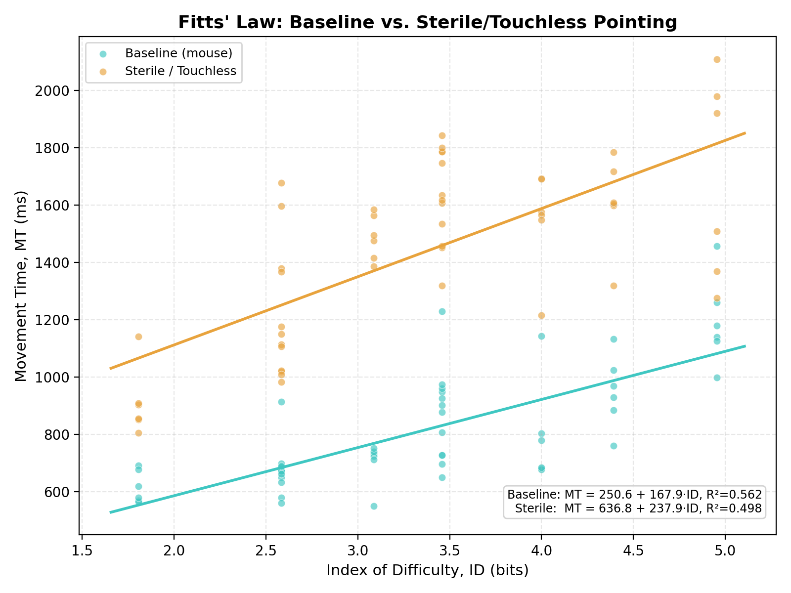

# Sterile Console: An Empirical Analysis of Fitts' Law for Aseptic Direction in Operating Rooms Using Remote Gesture Control

## 1. Project Links and Results Showcase

- **GitHub Pages URL:** https://yukitsai0731.github.io/fitts-law-sterile-console/
- **Experiment Screen Recording:** https://youtu.be/_jZo_nhNm6k

## 2. Context and Real-World HCI Issues

- **Target Users:** Surgeons and surgical assistants in the operating room.
- **Usage Scenario:** During surgery performed under highly aseptic conditions, physicians frequently need to review medical images, switch endoscopic views, or mark distances.
- **Current Clinical Pain Points:** If physicians cannot operate the devices themselves and can only verbally instruct the hand-scrubbing nurses, it can easily lead to unclear and repetitive communication, surgical interruptions, and increased communication costs. If physicians remove their sterile gloves to operate the physical mouse or touchscreen, and then re-scrub and re-glove, it may also increase the risk of patient infection.
- **Core HCI Challenge:** How to design a completely contactless, yet highly accurate and fast-pointing, gesture-based interface?

## 3. Modeling Innovative Concepts and Fitts' Law

The core concept of this project is to compare the behavioral differences of the same target-oriented task under different input modes by controlling variables, and to quantify the specific impact of aseptic remote manipulation on human motor control using the empirical parameter changes of Fitts's Law.

- **Control group (Baseline):** Direct mouse control, representing an ideal operating benchmark with desktop support and no algorithmic latency.
- **Experimental group (Sterile / Touchless):** Users' wrists lack physical desktop support, making them prone to cantilever tremors. The program introduces small-amplitude random displacement noise, and simultaneously simulates the pipeline time of an RGB/depth camera in feature recognition and coordinate filtering, adding approximately 140 ms of visual tracking latency.

Fitts' Law theory predicts:

```
Movement Time (MT) = a + b · ID = a + b · log2(A/W + 1)
```

## 4. Application System Design and Experimental Architecture

- **Target distance A:** 200 px / 400 px / 600 px
- **Target width W:** 20 px / 40 px / 80 px
- **Difficulty index range (ID):** approximately 1.8 – 5.0 bits
- **Trial configuration:** 3 × 3 = 9 geometric combinations, each combination repeated 6 times in randomized order, per condition — 54 trials per condition, 108 total trials.

## 5. Experimental Results

| Condition | Trials | Mean MT (ms) | Errors |
|---|---|---|---|
| Baseline | 54 | 927.5 | 2 |
| Sterile / Touchless | 54 | 1438.4 | 4 |

### Regression (Fitts' Law fit)

| Condition | a (intercept, ms) | b (slope, ms/bit) | R² | Throughput IP (bits/s) |
|---|---|---|---|---|
| Baseline | 250.6 | 167.9 | 0.562 | 5.95 |
| Sterile / Touchless | 636.8 | 237.9 | 0.498 | 4.20 |

**Baseline equation:** `MT = 250.6 + 167.9 · log2(A/W + 1)`
**Sterile equation:** `MT = 636.8 + 237.9 · log2(A/W + 1)`



### Analysis

**Change in intercept *a*:** The fixed 140 ms visual tracking latency and the absence of direct contact feedback in the gesture-tracking pipeline raise the fixed startup cost of every pointing movement — *a* rises from 250.6 ms (Baseline) to 636.8 ms (Sterile), a 2.5× increase before any distance/width effect is even considered.

**Change in slope *b*:** The positional jitter introduced by an unsupported, suspended arm interferes most with the closed-loop fine-adjustment phase near the target boundary — the phase that matters most for small, high-ID targets. This pushes the slope *b* up from 167.9 to 237.9 ms/bit, meaning each additional bit of difficulty costs proportionally more time under the touchless condition. Consistent with this, the error count also rose from 2 to 4 misses across the same 54-trial block.

**Throughput (IP):** Index of performance drops from 5.95 bits/s (Baseline) to 4.20 bits/s (Sterile) — roughly a 29% reduction in the surgeon's effective pointing bandwidth when the interface goes fully touchless.

**Design implication:** For a sterile, gesture-controlled operating-room console to remain usable, on-screen controls should be sized generously (comfortably above the ~40 px width tested here) to keep the effective ID — and therefore the time and error cost of the added latency and jitter — within an acceptable range for time-critical intraoperative use.
